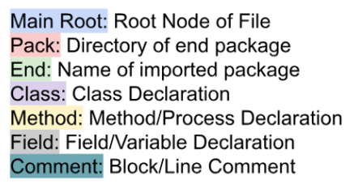
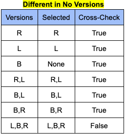
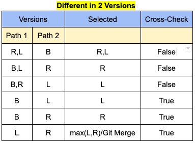
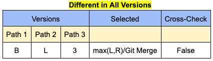

<div align="center">
  <a href="https://github.com/ace-design">
    
  </a>
  <h1>Git Merge ADV</h1>
</div>

<details>
  <summary>Table of Contents</summary>
  <ol>
    <li>
      <a href="#project-description">Project Description</a>
        <ul>
          <li><a href="#rationale">Rationale</a></li>
          <li><a href="#developed-data-structure">Developed Data Structure</a></li>
          <li><a href="#selective-set-union">Selective Set Union</a></li>
          <li><a href="#built-with">Built With</a></li>
        </ul>
    </li>
    <li>
      <a href="#getting-started">Getting Started</a>
      <ul>
        <li><a href="#required-modules">Required Modules</a></li>
        <li><a href="#usage">Usage</a></li>
        <li><a href="#tool-prerequisites">Tool Prerequisites</a></li>
        <li><a href="#git-integration">Integrate with Git</a></li>
      </ul>
    <li>
      <a href="#contacts">Contacts</a>
    </li>
    </li>
    <li><a href="#acknowledgments">Acknowledgments</a></li>
    </li>
    <li><a href="#licence">Licence</a></li>
  </ol>
</details>

# Project Description
  ## Rationale
  Source code merging has always been an issue for developers. When colloborating on complex projects, developers must inevitably use multiple branches, which is the cause for numerous merge conflicts. These conflicts often waste a lot of their time. 
  
  Existing 3-way merge algorithms developed by Git rely on textual difference, which often leads it to incorrectly resolve the conflicts or cause merge conflicts. 
  
  Other 3-way merge algorithms such as JDime or Spork take a strucutred approach which use Abstract Syntax Trees, however are limited in the scope in which they can be used.
  
  As such, our purpose is to develop a new 3-way merge tool for Python and Java Source Code. 
  
  ## Developed Data Structure
  Mainly focused on Java & Python code to develop a general data structure that can represent statically & dynamically typed languages. 

  We used the CST (Concrete Syntax Tree) generated by Tree-Sitter (for Java), and the AST (Abstract Syntax Tree) generated using Python's ast library to provide the prelimary code structures. We then queried the Syntax Trees to construct our Abstract Data Structure.

  This is relevant to CompressedTree and MethodUnion tools.

<div align="center">
     </img>
     </img>
</div>


  ## Selective Set Union

  Our tools use the following heuristics:

<div align="center">
   </img>
   </img>
   </img>
</div>


  ## Built with:
  <ul>
    <li>Python</li>
  </ul>


# Getting Started

## Required Modules

* Before using any tool or any script in this repository, you will need to install all the necessary python modules given in [requirements.txt](requirements.txt).

      pip3 install -r requirements.txt

## Usage
* The [extracting-scripts](extracting-scripts/) directory contains all the tools needed to extract case studies from various github repositories
* The [merge-algorithms](merge-algorithms/) directory includes all the merge tools that were developed in this project. The two main tools being [CompressedTree](merge-algorithms/CompressedTree/) and [MethodUnion](merge-algorithms/MethodUnion).
* The [demos](demos/) directory includes all the case studies that were tested, and the overall results obtained from this project.

## Tool Prerequisites
  <h4>Run Tools:</h4>

  ```
  python3 <path to alg init.py> --left <left parent path> --right <right parent path> --base <base file path> --out <output file>
  ```

  * Assumption: Input files are of correct syntax. Tools will not work with incorrect syntax. 

## Git-Integration

  1. Create a .gitattributes file in your repo 
  2. add following lines to it

  ```
  *.java merge=gitadv
  *.py merge=gitadv 
  ```


  3. Run command `git config --global --edit`
  4. Add following lines to config file

  ```
  [merge "gitadv"]
  name = gitadv
  driver = python3 /path/to/repo/git-merge-adv/merge-algorithms/CompressedTree/init.py --left %A --right %B --base %O --output %A --file %P
  ```

# Contacts
  <ul>
    <li>Sebastien Mosser - mossers@mcmaster.ca</li>
    <li>Madhur Jain - 21112002mj@gmail.com</li>
    <li>Nirmal Chaudhari - chaudn12@mcmaster.ca</li>
  </ul>

# Acknowledgements
* Parts of scripts obtained from [https://github.com/ace-design/git-corpus]
* All Case Studies for Java obtained from Awesome Java List: [https://github.com/akullpp/awesome-java]
* All Case Studies for Python Obtained from Awesome Python List:[https://github.com/vinta/awesome-python]
* CST generated using Tree-Sitter [https://github.com/tree-sitter/tree-sitter]


# Licence
Distributed under the MIT License. See LICENSE.txt for more information.
