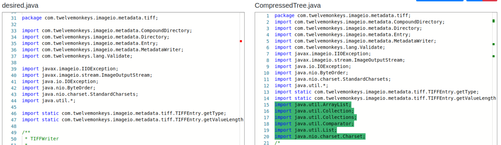
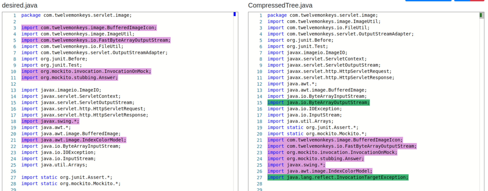

# TwelveMonkeys Demos

The purpose of these demos is to provide a visual representation of what our algorithms do, compared to what the user wanted.

## Prerequisites:
* desired.java: What the user manually did
* [algorithm].java: What our algorithm did without the user.

## CompressedTree Algorithm:

#### <b>ImportC1-TwelveMonkeys</b>

#### <b>ImportC2-TwelveMonkeys</b>
