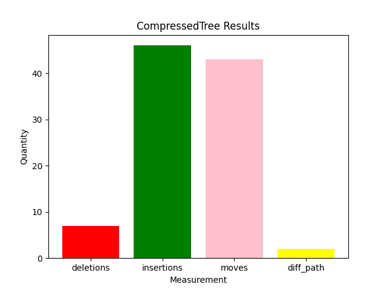
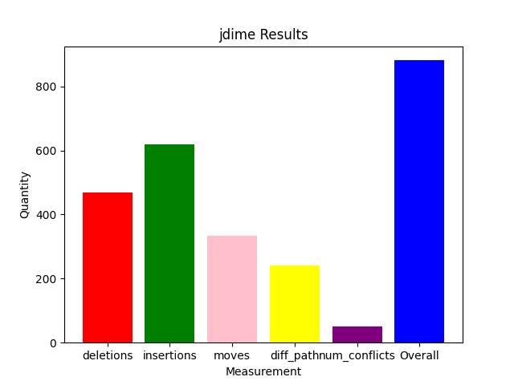
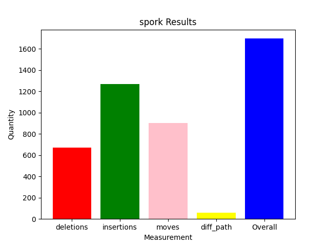

# Java Demos

## Results

### CompressedTree Algorithm:

* 7 Deletions
* 46 insertions
* 43 Moves
* 5 Different Paths

### JDime Algorithm:

* 15 Deletions
* 24 insertions
* 9 Moves
* 1 Different Paths

### Spork Algorithm:

* 13 Deletions
* 24 insertions
* 88 Moves
* 0 Different Paths

## Prerequisites:

* Deletions: Every package in desired version that isn't there in the resulting file.
* Insertions: Extra packages present in the result that are not there in the desired.
* Moves: Number of import statements in the result that are in a different spot from desired.
* Different Paths: Number of import statements in result that are from the wrong path.

## Acknowledgements:

Case Studies obtained from the following repositories:
* Cucumber-jvm: [https://github.com/cucumber/cucumber-jvm]
* TwelveMonkeys: [https://github.com/haraldk/TwelveMonkeys]

