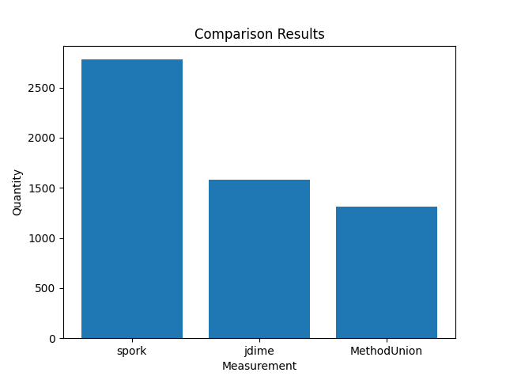

# Java Demos

## Rationale:

Analysis of case studies from credible, and well-developed projects help us obtain quality results that we can use to further support our project development.

Our focus on Java will provide us with specific syntax that we can use to develop a lower level algorithm. 

## Results:

### Quantitative Data:

Tool | Deletions | Insertions | Moves | Diff Paths | Num Conflicts | Num Errors | Overall |
--- | --- | --- | --- |--- |--- |--- |--- |
CompressedTree | 343 | 713 | 471 | 84 | 134 | 0 | 934.28 |
MethodUnion | 535 | 1238 | 622 | 76 | 67 | 0 | 1488.63 |
Spork | 992 | 2150 | 1534 | 156 | 96 | 0 | 2827.24 |
jDime | 1073 | 1143 | 761 | 322 | 119 | 2 | 1776.27 |

### Interesting Case Studies:

Case Study | Overall | Description |
--- | --- | --- |
antlr4/importC4 | 54.78 | Left & Base versions have different class declaratins from Right version. Developer wanted modifications done to methods in the Left version, but class declaration of the right version. Our tool only chooses from methods in the Right version, and ignores the Left & Base. Weird because the developer decides that the class should implement an interface in the Right version, and changes each method in the Left version.  |
mongojack/conflict1 | 56.12 | All 3 versions have 2 overloading constructor methods each. Right version modifies the parameters for both constructor. Left version also introduces a new parameter than isn't there in the Base or Right. Our tool unions all constructors as a whole across the versions that have different signatures. It is incorrect because the desired version wants to keep 2 constructors, but union all unique parameters across the 3 versions. Our tool will throw a run-time error.  |
aws/conflict2 | 13.78 | Interesting case where our heuristic was incorrect. The developer introduced a new method and field declaration in the Left version, however decided to exclude it and choose the Right/Base version in the conflict resolution. Logically our tool chooses the most updated version, but it seems the user did not want this in this case.  |
openshift-java-client/conflict15 | 342.43 | A lot of method overloading was done in this case study, and our tool just unions everything. This causes a lot of insertions, which may be the reason the overall score is so high. In addition, some methods have been modified by the developer in the merge conflict. This causes semantic inaccuracy, which may also be why the overall score is so high.  |
openshift-java-client/conflict12 | 190.06 | Similar to conflict15 above, where there are a lot of overloading methods which caused a lot of insertions. However, in this case the developer decided to add something that wasn't present across any of the 3 version to many methods. Causes a lot of semantic inaccuracy. |
Jest/conflict9 | 50.17 | Interesting how one, small change in parameter name can cause so many differences. In this case, the developer changes "addEsMetadataIDFields" parameter name to "addEsMetadataFields", but this causes the result to have both method declaration (both of which are incorrect). Desired result is "addEsMetadataFields" with the changes made to "addEsMetadataIDFields" in another version. However since they don't have the same signature, it doesn't do that.  |
Jest/conflict12 | 2.87 | Git generated file presented many merge conflicts, but our tool was able to resolve every conflict correctly. It also was more semantically accurate than jDime and Spork. |
Jest/conflict4 | 1.41 | Interesting case study where our tool generated a file that was the same as Git's generated file, with the same single merge conflict in the exact same place. | 

## Pre-requisites:

* `base.java`: Common ancestor between left and right parents.
* `left.java`: Left parent of merge
* `right.java`: Right parent of merge
* `desired.java`: Version of file after user manually handled.
* `git.java`: Version of file after git algorithm tried to handle.
* `spork_result.java`: Version of file after spork tried to handle.
* `jdime.java`: Version of file after jdime tried to handle.

## Next Steps:

* Use the class identifier as the reference for all methods, instead of full class declaration.
* Selective union between methods with same name but signature (currently just unions all methods with slightly different signature).
* Work on ordering of methods and comments. General ordering is accurate for the most part, but large number of moves.
* Merging segments within methods (sequential sets). Currently out of our scope.

## Prerequisites:

* Deletions: Every package in desired version that isn't there in the resulting file.
* Insertions: Extra packages present in the result that are not there in the desired.
* Moves: Number of import statements in the result that are in a different spot from desired.
* Different Paths: Number of import statements in result that are from the wrong path.

### References and Acknowledgements:

* All projects chosen from Java Awesome List: [https://github.com/akullpp/awesome-java]

