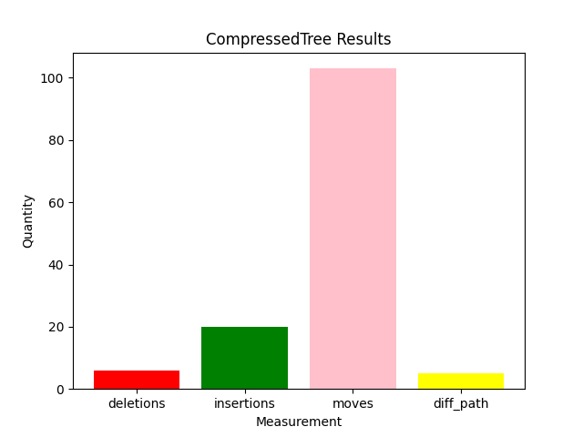

# Python Demos

## Results

* Note: Formatting still needs to be fixed. Gumtree is inaccurate because of formattting, so results need to be updated after it is fixed. 

### CompressedTree Algorithm:

* 6 Deletions: Every package in desired version is present in the result.
* 20 insertions: Extra packages present in the result that are not there in the desired.
* 103 Moves: Number of import statements in the result that are in a different spot from desired.
* 5 Different Paths: Number of import statements in result that are from the wrong path.

## Acknowledgements:

Case Studies obtained from the following repositories:
* Cryptography: [https://github.com/pyca/cryptography]
* mypy: [https://github.com/python/mypy]

