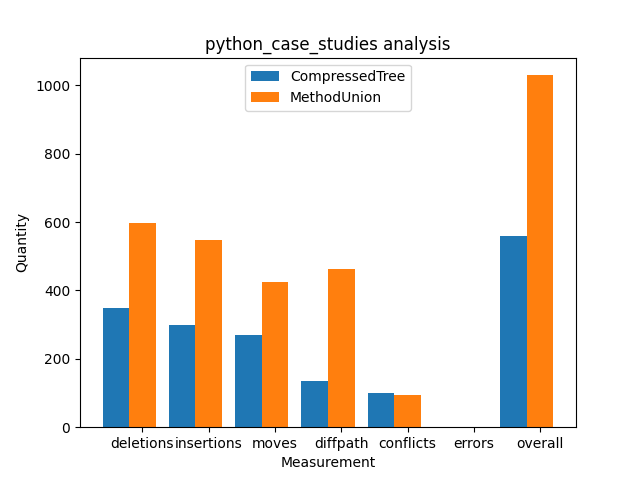

# Python Demos

## Rationale

Analysis of case studies from credible, and well-developed projects help us obtain quality results that we can use to further support our project development.

Our secondary focus on Python will provide us with specific syntax that we can use to develop a slightly higher level algorithm than our previous Java one. 

## Results

Tool | Deletions | Insertions | Moves | Diff Paths | Num Conflicts | Num Errors | Overall |
--- | --- | --- | --- |--- |--- |--- |--- |
CompressedTree | 383 | 350 | 301 | 170 | 100 | 0 | 631.42 |
MethodUnion | 714 | 602 | 452 | 504 | 93 | 1 | 1158.05 |

## Next Steps

* Formatting still needs to be fixed. Gumtree is inaccurate because of formattting, so results need to be updated after it is fixed. 
* Include comments in the merged files who's body use our tool.
* Use existing Field Class for class fields, rather than strings.
* Extend python merging to encompass more than strictly classes and methods. Reduce how much Git is used for the body.

### References and Acknowledgements:

* All projects chosen from Python Awesome List: [https://github.com/vinta/awesome-python]
* Code Differencing results obtained from Gumtree: [https://github.com/GumTreeDiff/gumtree]

