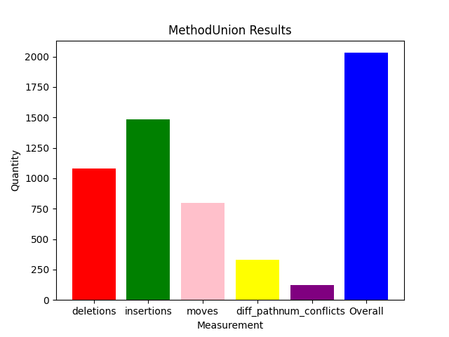
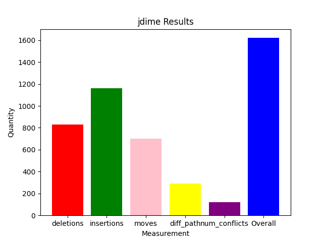
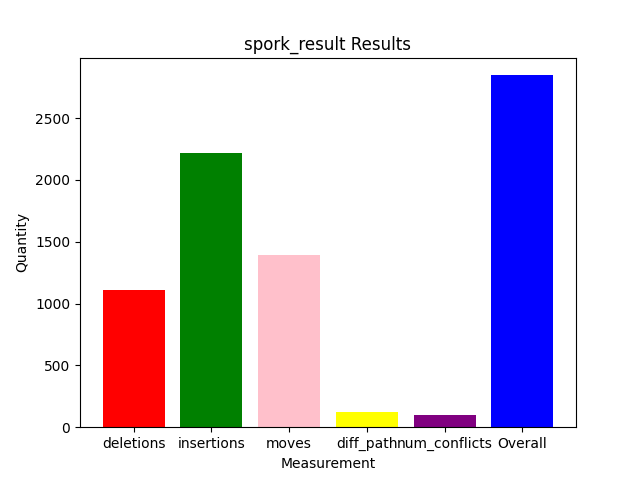
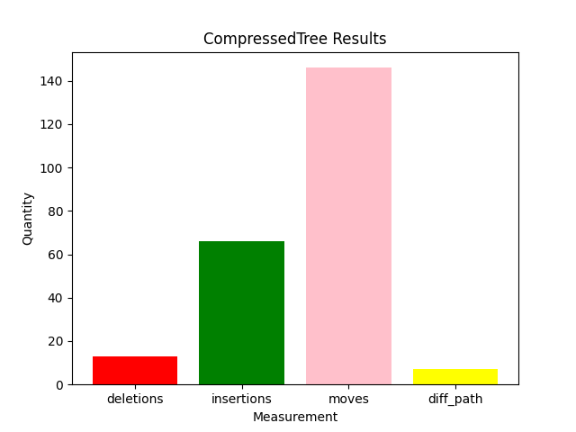

# Algorithm Demos

## Rationale

In order to better understand to strengths and limitations of our algorithms, it is necessary for us to perform tests as "demos". 
* As such, the purpose of this folder is to provide a visual and quantitative representation of our current work. 

## Results

### MethodUnion

### jdime

### spork

### CompressedTree

## Prerequisites

Execute run_algo.py:

`python3 run_algo.py --cs <path to case study folder> --algo <name of desired algorithm> --lang <language used in case study> --purpose <all or spec>`

Execute run_analysis.py:

`python3 run_analysis.py --dir <path to case study>`

## Acknowledgements

* All quantitative measurements, and visuals obtained from [https://github.com/GumTreeDiff/gumtree]

Run GumTree:

`java -jar gumtree.jar webdiff <Path to File1> <Path to File2>`

* Important Note: When trying to use Gumtree for python files, make sure you add the pythonparser to your local computer path from [https://github.com/GumTreeDiff/pythonparser]

    1. Clone the repository
    2. cd pythonparser/
    3. pip install -r requirements.txt
    4. cp pythonparser /tmp
    5. PATH=$PATH:/tmp

