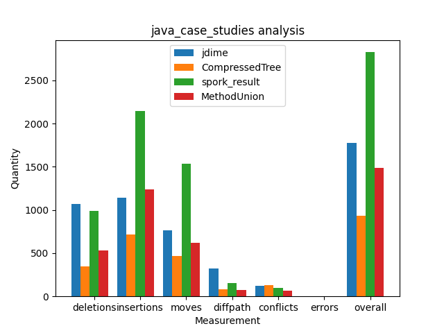
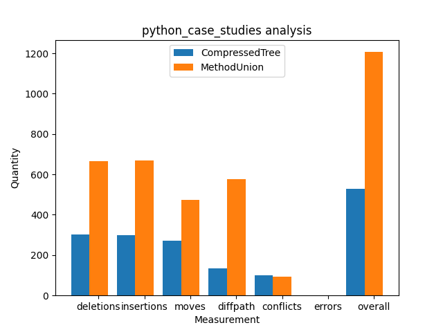

# Algorithm Demos:

## Rationale:

In order to better understand to strengths and limitations of our algorithms, it is necessary for us to perform tests as "demos".
* All case studies are extracted from a curated list of well-known projects obtained from the Awesome Python and Java lists.

## Results:

### Java Results:



Tool | Deletions | Insertions | Moves | Diff Paths | Num Conflicts | Num Errors | Overall |
--- | --- | --- | --- |--- |--- |--- |--- |
CompressedTree | 343 | 713 | 471 | 84 | 134 | 0 | 934.28 |
MethodUnion | 535 | 1238 | 622 | 76 | 67 | 0 | 1488.63 |
Spork | 992 | 2150 | 1534 | 156 | 96 | 0 | 2827.24 |
jDime | 1073 | 1143 | 761 | 322 | 119 | 2 | 1776.27 |

Overall empirical results suggest that CompressedTree & MethodUnion are more semantically equivalent to the desired version than other tools. 
Results show that: 
* Tools are removing less necessary code
* Merged result will include less unused code
* Original code structure is being preserved better
* Tools choose correct changes more often

For the Java MethodUnion Merge, the next steps would include:
* Improving merges associated with overloaded methods:
    *  Currently, our tool simply unions all overloaded methods since it sees each method with a different signature as a different method. 
    * However, we need to come up with a way to compare them with each other in the final merge. 
    * One possible solution that was entertained for this way to see methods with the same name as the same method. However, then our merged file would remove all overloaded methods (which is not what the user wants).
    * Solving this problem would significantly improve the overall accuracy for MethodUnion in Java Case Studies, as we see that all the signficant differences come from these kinds of case studies.
    * Hint: To start solving this problem, maybe play around with the Method equivalence relation. Changing this would change whether two methods are precieved as equivalent.
* Improving how many developer's comments are kept in the generated file:
    * Although our tool adequetly retains the developer's comments for Java, it can still be improved as we realized it still doesn't keep all the commnets.
    * Hint: To resolve this, try experimenting with how comments are queried from the tree-sitter-java's CST. My assumption is that a lot of the comments aren't even being extracted. After this, check how they are being added to the abstract data structure (whether only blocks are being added, or if lines are also being added). 


### Python Results:



Tool | Deletions | Insertions | Moves | Diff Paths | Num Conflicts | Num Errors | Overall |
--- | --- | --- | --- |--- |--- |--- |--- |
CompressedTree | 301 | 298 | 270 | 134 | 99 | 0 | 529.21 |
MethodUnion | 666 | 668 | 472 | 578 | 93 | 0 | 1206.3 |

CompressedTree and MethodUnion also demonstrate strong accuracy for Python
* Results for Java were from a total of 86 case studies,
whereas Python a total of 91 case studies
* Given this, the ratio of Overall results to case studies
is better for Python

For the Python MethodUnion Merge, the next steps would include:

* Use Tree-Sitter's CST for Python code extraction instead of the AST library:
    * From the interesting case studies for Python code we noticed a lot of the differences come from the fact that the AST library reformats the code. This causes a lot of differences between the developer's code and our tool's generated code.
    * Hint: To do this, simply add the tree-sitter-python repository as a submodule of the project like we did with Java. Then follow what was done for tree-sitter-java in the spec.py file of MethodUnion but for Python.
    * Useful tool in facilitating this process is to use [https://tree-sitter.github.io/tree-sitter/playground] to determine how to query certain code segments from the generated CST.
* Actually using Field objects to compare class attributes instead of strings.
    * Will improve which field to choose when merging classes. 
    * Right now, the tool is basically just unioning all the fields across the 3 versions.
* Extend the code that arranges the order of methods and code segments in Java to Python. 
    * Currently, the merged result for Python code is not ordered which is one of the reasons why there is a significant difference between CompressedTree and MethodUnion results.
    * Hint: The method that arranges this is already written in the Node file. Just make the python code use it as well.
* Retain the developer's comments in the merged result.
    * As of now, the python AST library that we used did not include comments, and as such we were unable to include comments in the merged results. 
    * Switching over to tree-sitter would make this problem a lot easier as seen on the Java side. 


For the MethodUnion Merge as a whole for both Python and Java code, the next steps would include:

* Improving how code is ordered in the generated file:
    * This problem is mainly evident in files that contain super classes with numerous methods. From our case studies, we noticed there are a lot of misordered code segments within these classes in our generated version. 
    * Currently, our tool keeps reference of the code segment's line number in the original file, and simply orders the final list based on the the line numbers
    * However, I have doubts about how well this works. For example, if two identical methods across two versions have different line numbers, which does it keep? And does this align with the user's desired version? Maybe we should take the average or choose the line number that occurs most often. We must experiment with this. 

The overall difference between CompressedTree and MethodUnion is small in Java meaning our heuristics provide approximately the same accuracy as Git Merge on the body with half the conflicts.

Logically the difference in Python makes sense since we have yet to add comments and maintain the code structure for it. 

## Comparison Methodlogy:
 To analyze the accuracy of each tool, we measured the difference between the developer's desired version and results generated by each tool using Gumtree. 

 ### Measurements for Comparison:
 * Deletions: Code that is present in desired version but not in the result.
 * Insertions: Code that is present in the result, but not the desired version.
 * Moves: Same code, but on different lines
 * Diff Paths: Same structure, but slightly different code segments.
 * Conflicts: Conflicts present after the merge is complete.
 * Errors: Gumtree cannot execute because of syntax errors in the generated results.

The overall accuracy is measured as the vector distance from the desired version using all measurements.

> Overall = Deletions<sup>2</sup> + Insertions<sup>2</sup> + Moves<sup>2</sup> + Diff_Paths<sup>2</sup> + ...

### Assumptions:
1. All input files are of correct syntax. Any case study with incorrect input files will be eliminated from results.
2. Developers will choose the correct conflict resolution when having to manually resolve some merge conflicts.
    * To account for this in our comparison, we cross reference each merge conflict in generated file to the desired version to see what the developer wants. As such, it will be <i>ignored</i> by gumtree.

### Comparison Replication:
1. Use the run_algo.py script to generate the resulting file for each merge case study. 
2. Generate the conflict-free resulting file from tool by parsing each case study resulting file and resolving all merge conflicts by checking resolution in desired file. 
3. 
* For Python: Run gumtree `textdiff` with `theta` matcher (-m flag) for import statements differencing and `gumtree-simple-id` matcher (-m flag) for body differencing. This will generate a csv file with all code comparison. 
* For Java: Run gumtree with `gumtree-simple-id` matcher (-m flag) with `java-jdt` generator (-g flag) for both import and body differencing. 
4. Parse the csv file to extract all deletions, insertions, moves and updates. Ignore all differences that are 1 character long (likely a parsing error).
5. Tally all respective measurements and calculate the overall result.


## Prerequisites:

### &nbsp; Usage:
* The [dependencies](dependencies/) folder contains the gumtree jar file, and pythonparser, which are needed for code differencing.
* The [scripts](scripts/) folder contains all the scripts used to run the case studies for Java and Python.
* The [java_case_studies](java_case_studies/) and [python_case_studies](python_case_studies/) folders contaiins all the case studies for Java & Python respectively. 
    *  In that, [demo_results](java_case_studies/demo_results/) contains all the generarted file for each tool that is run. It also contains the csv files for each tool which show the result of gumtree on each case study.
    * The [reference_repos](java_case_studies/reference_repos/) contains all the associated files for each case study organized by parent repository.
    * The [images](java_case_studies/images/) contains the graphs for each tool comparison.

### &nbsp; Script Commands:

> run_algo.py:

&nbsp; &nbsp; &nbsp; Purpose:
* To run specified case studies using desired tool. Can run one, or multiple case studies. 
* Outputs result of each case study to [Python demo_result](python_case_studies/demo_results/) or Java [Java demo_result](java_case_studies/demo_results/) folder under specified tool. 
* All quantitative results will be added to the associated .csv files for each tool under demo_result.

&nbsp; &nbsp; &nbsp; Execution: 
```
python3 <path to run_algo.py>/run_algo.py --cs <path to case study folder> --algo <name of desired algorithm> --lang <language used in case study> --purpose <all or spec>
```

&nbsp; &nbsp; &nbsp;Flags:
* cs: Enter the path to desired case study. Can be parent directory (purpose is to run all), or specific case study directory (purpose is to run spec)
* algo: Enter the name of desired Tool (MethodUnion, CompressedTree, etc...)
* lang: Enter the language for the case study
* purpose: Specify whether you want to run multiple case studies (all) or just one (spec)


> run_analysis.py:

&nbsp; &nbsp; &nbsp; Purpose:
* To output a graph/visual comparison between all tools that were run. 
* Graph will be outputted to [Python Images](python_case_studies/images/Comparison.png) or [Java Images](java_case_studies/images/Comparison.png) depending on the language.
* Script will also output all numerical data in terminal.

&nbsp; &nbsp; &nbsp; Execution:
```
python3 run_analysis.py --dir <path to case study>
```

&nbsp; &nbsp; &nbsp; Flags:
* dir: Enter the path to the directory 

> run_diff.py:

&nbsp; &nbsp; &nbsp; Purpose:
* To document the git difference between all relevant files for each case study. This includes base vs left, base vs right, left vs right, desired vs spork, desired vs jdime and desired vs our generated file.
* The difference will measure the overall structural similarities between all files. 

&nbsp; &nbsp; &nbsp; Execution:
```
python3 run_diff.py --lang <python or java>
```

&nbsp; &nbsp; &nbsp; Flags:
* lang: Enter the language of associated case studies (python or java case studies)

### &nbsp; Gumtree Commands:

> Python Execution:

&nbsp; &nbsp; &nbsp; Import Differencing:

```
java -jar gumtree.jar -m theta webdiff <Path to Desired Version> <Path to Generated Version>
```
&nbsp; &nbsp; &nbsp; Body Differencing:

```
java -jar gumtree.jar -m gumtree-simple-id webdiff <Path to Desired Version> <Path to Generated Version>
```

* Important Note: When trying to use Gumtree for python files, make sure you add the pythonparser to your local computer path from [https://github.com/GumTreeDiff/pythonparser]

    1. Clone the repository
    2. cd pythonparser/
    3. pip install -r requirements.txt
    4. cp pythonparser /tmp
    5. PATH=$PATH:/tmp

> Java Execution:

```
java -jar gumtree.jar -m gumtree-simple-id -g java-jdt webdiff <Path to Desired Version> <Path to Generated Version>
```


## Acknowledgements

* All quantitative measurements, and visuals obtained from [https://github.com/GumTreeDiff/gumtree]

