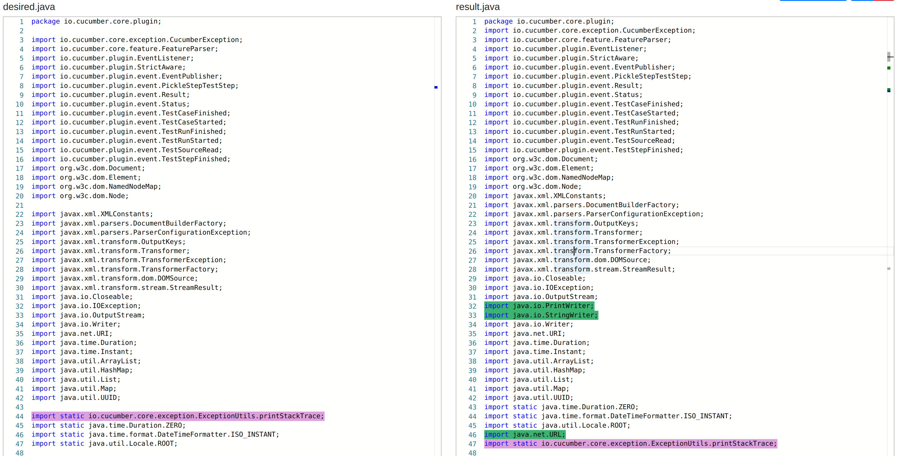
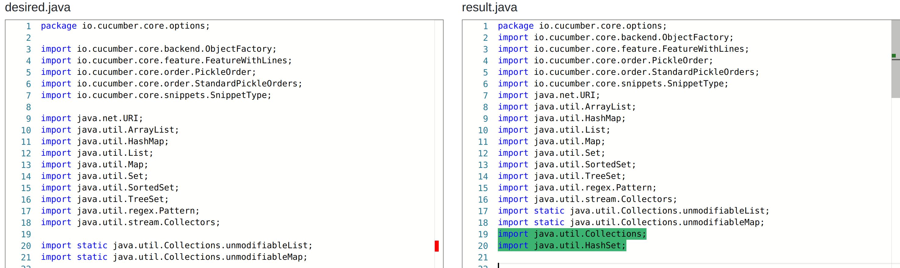
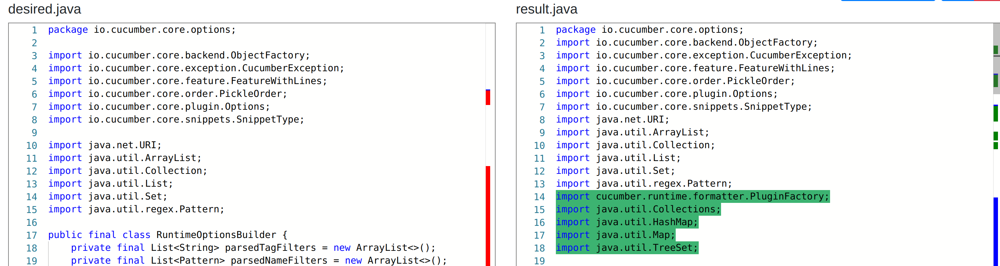
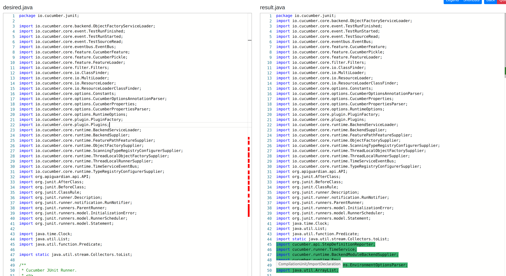
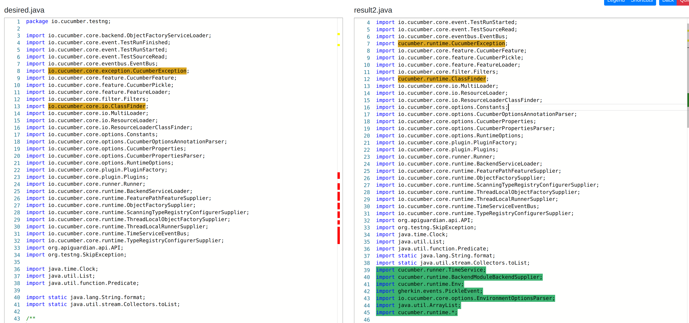
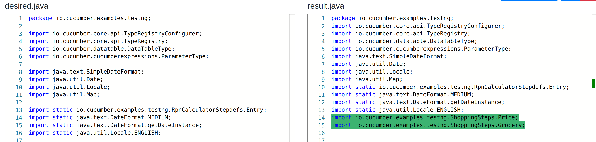

# Compressed Import Tree

* Works off structure of Abstract Import Tree.
* Tree strucutre is more compressed, to allow more focus on the end desired packages, instead of entire path. Less computation time. 

### <u>Future Development:</u>
* Reorganize code, and make it more readable. 

### <u>Script Pre-Requisites:</u>

* Run Compressed Import Tree:

    `python3 init.py --left <left parent path> --right <right parent path> --base <base file path> --out <output file>`

### <u>Demos/Case Studies</u>

* Test case files obtained from [https://github.com/cucumber/cucumber-jvm]
* Analysis of demos, and pictures obtained from [https://github.com/GumTreeDiff/gumtree]

#### <b>ImportC1-Cucumber-jvm</b>

#### <b>ImportC2-Cucumber-jvm</b>

#### <b>ImportC3-Cucumber-jvm</b>

#### <b>ImportC4-Cucumber-jvm</b>

#### <b>ImportC5-Cucumber-jvm</b>

#### <b>ImportC6-Cucumber-jvm</b>
